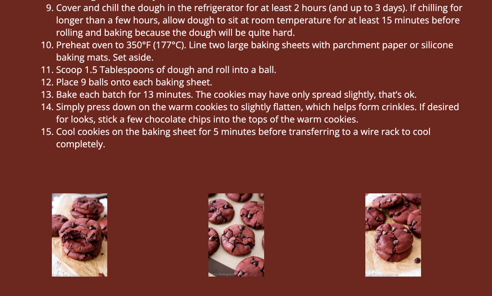

# Red Velvet Cookies Recipe


## Objective
Use CSS Flexbox for a website about Red Velvet Cookies Recipe (Responsive layout structure, parent/child nodes). Create a red velvet cookie recipe website. 

## Difficulty
Easy/Intermediate

## Prerequisites
To complete this project: students should have the following:
- Basic understanding of HTML structures and attributes
- Basic understanding of CSS (Selectors, properties)

## Concepts
| HTML | Description |
| --- | --- |
| img | image tag |
| p | paragraph tag |
| br | breaks the line of the sentance |
| h1 | heading 1 |
| h2 | heading 2 |
| element | An element is an individual part, or a building block, of a web page |
| attribute | A modifier of an element |
| div | A container element |
| ul | An unordered list element |
| ol | An ordered list element |
| li | A list item element |
| section | A tag that defines a section |

| Relative File Paths	 | Description |
| --- | --- |
| images/picture.jpg	 | In the images images folder, points to the picture.jpg |


| CSS | Description |
| --- | --- |
| background-color | Specifies the background color of an element |
| text-align | Specifies the horizontal alignment of text |
| font-family | Specifies the font family for text |
| letter-spacing | Increases or decreases the space between characters in a text |
| font-size | Specifies the font size of text |
| justify-content | Specifies the alignment between the items inside a flexible container when the items do not use all available space |
| display | Specifies how a certain HTML element should be displayed |
| margin-left | Sets the left margin of an element |
| margin-right | Sets the right margin of an element |
| float | Specifies whether an element should float to the left, right, or not at all |
| padding | A shorthand property for all the padding-* properties |
| margin | Sets all the margin properties in one declaration |
| align-items | Specifies the alignment for items inside a flexible container |


## Part I: Complete HTML

### Head
1. Replace the original ```<head></head>``` with the code below. 

```
<head>
  <meta charset="utf-8">
  <meta name="viewport" content="width=device-width">
  <title>replit</title>
  <link href="style.css" rel="stylesheet" type="text/css" />
  <link href="https://fonts.googleapis.com/css2?family=Bebas+Neue&family=Open+Sans:ital,wdth,wght@0,83.2,524;0,100,300;0,100,400;0,100,700;0,100,800;1,100,800&family=Spartan&display=swap" rel="stylesheet">
<link href="https://fonts.googleapis.com/css2?family=Open+Sans:ital,wdth,wght@0,83.2,524;0,100,300;0,100,400;0,100,700;0,100,800;1,100,800&family=Spartan&display=swap" rel="stylesheet">
</head>
```

### Body 
2. Use this [recipe](https://sallysbakingaddiction.com/red-velvet-chocolate-chip-cookies/) to fill out the content of your website:
   - Create a ```<h1>INSERT TITLE</h1>``` for your title
   - Create a ```<p class="author">INSERT NAME</p>``` for your name
   - Add  ``` ```


4. Create an *about* section
  - Create a ```<section class="about"></section>``` for your about section   

Example: 
```
<section class="about">
<!----"p1" can be changed into anything you like, you can even say "paragraph1"---->
    <p>A friend of mine loves red velvet cookies and decided to draw a picture of her standing on a stack of red velvet cookies.
<!----break separates sentences from each other---->
      <br> Being inspired by this image, I wondered how does one actually make red velvet cookies.</p>
```

  * ```section``` with a ```class``` of "about"
    *   ```p``` about the reason for your recipe

  * ```section``` with a ```class``` of "ingredients"
    * ```h2``` title of the section for ingredients
    * ```ul``` and ```li``` start creating the list of ingredients

* ```section``` with a ```class``` of "steps"
  * ```h2``` title of the section for steps
  * ```ol``` and ```li``` start creating the list of steps
  * 
5.  Create an *ingredients* section
  - Create a ```<section class="ingredients"></section>``` for your about section
  - Insert the following:

```
<h2>Ingredients</h2>
    <ul>
      <li>1 and 1/2 cups + 1 Tablespoon (196g) all-purpose flour (spoon & leveled</li>
      <li>1/4 cup (21g) unsweetened natural cocoa powder</li>
      <li>1 teaspoon baking soda</li>
      <li>1/4 teaspoon salt</li>
      <li>1/2 cup (115g) unsalted butter, softened to room temperature</li>
      <li>3/4 cup (150g) packed light or dark brown sugar</li>
      <li>1/4 cup (50g) granulated sugar</li>
      <li>1 large egg, at room temperature*</li>
      <li>1 Tablespoon milk (I use buttermilk)</li>
      <li>2 teaspoons pure vanilla extract</li>
      <li>1/2 teaspoon gel red food coloring (or alternative)*</li>
      <li>1 cup (180g) semi-sweet chocolate chips (plus a few extra for after baking </li>
    
    </ul>
```

6.  Create an *steps* section
  - Create a ```<section class="steps"></section>``` for your about section
  - Insert the following:

```
<h2>Steps</h2>
<!---"ol" creates a numbered list vs the "ul" that creates just a bulleted list--->
  <ol>
    <li>Whisk the flour, cocoa powder, baking soda, and salt together in a large bowl. Set aside.</li>
    <li>Using a handheld or stand mixer with a paddle attachment, beat the butter on high speed until creamy, about 1 minute.</li>
    <li>Scrape down the sides and the bottom of the bowl as needed. </li>
    <li>Beat in the brown sugar and granulated sugar until combined and creamy, about 1 minute. </li>
    <li>Beat in the egg, milk, and vanilla extract, scraping down the sides and bottom of the bowl as needed. </li>
    <li>Once mixed, add the food coloring and beat until combined.</li>
    <li>Turn the mixer off and pour the dry ingredients into the wet ingredients. </li>
    <li>Turn the mixer on low and slowly beat until a very soft dough is formed. Beat in more food coloring if you’d like the dough to be brighter red. On low speed, beat in the chocolate chips. The dough will be sticky.</li>
    <li>Cover and chill the dough in the refrigerator for at least 2 hours (and up to 3 days). If chilling for longer than a few hours, allow the dough to sit at room temperature for at least 15 minutes before rolling and baking because the dough will be quite hard.</li>
    <li>Preheat oven to 350°F (177°C). Line two large baking sheets with parchment paper or silicone baking mats. Set aside.</li>
    <li>Scoop 1.5 Tablespoons of dough and roll into a ball.</li>
    <li>Place 9 balls onto each baking sheet.</li>
    <li>Bake each batch for 13 minutes. The cookies may have only spread slightly, but that’s ok.</li>
    <li>Simply press down on the warm cookies to slightly flatten, which helps form crinkles. If desired for looks, stick a few chocolate chips into the tops of the warm cookies.</li>
    <li>Cool cookies on the baking sheet for 5 minutes before transferring to a wire rack to cool completely.</li>
  </ol>
```


7. Add pictures of cookies in a ```row``` and 1 cookie picture per ```column```
   - Insert ```<div class = "row"></div>```
   - Create 3 ```<div class = "row"></div>``` inside the ```row div```
  
  Sample: 
  ```
  <div class = "row">
    <div class = "column">
    
    </div>
    <div class = "column"> 
   
    </div>
    <div class = "column">
    
    </div>
  </div>
  ```

  - Insert the image links below using the ```img``` tag and don't forget to include their alternatives
    - Example do not use on website: ``````
    1. [red velvet chocolate chip cookies 5](https://sallysbakingaddiction.com/wp-content/uploads/2013/12/red-velvet-chocolate-chip-cookies-5.jpg)
    2. [red velvet chocolate chip cookies 3](https://sallysbakingaddiction.com/wp-content/uploads/2013/12/red-velvet-chocolate-chip-cookies-3.jpg)
    3. [red velvet chocolate chip cookies 4](https://sallysbakingaddiction.com/wp-content/uploads/2013/12/red-velvet-chocolate-chip-cookies-4.jpg)
   

## Part II: Complete CSS
<br>
Use the CSS properties above to design your website in the CSS file
</br>
* Note: the # is where you input a digit/number

1. Start with your body be selecting the body tag followed by {}
    - ```background-color:``` //Set the background-color to #75201a or a color of your choice;
    - ```color:``` //Set the font-color to a color of your choice;
    - Sample:
    ```
    body {
        background-color: #75201a;
        color: #f7f0f0;
      }
    ```
2. Set [h1] to [value] or a value of your choice
    - ```text-align: center;``` //center your title
    - ```font-family: 'Bebas Neue', cursive;``` // or font of your choice
    - ```letter-spacing:``` #px;
    - ```font-size:``` #px;
4. Set [.author] to [value] // controls alignment of items, it will center items no matter what
    - ```justify-content: center;``` //center your title
    - ```text-align: center;``` // align the title
    - ```font-family: 'Open Sans', sans-serif;```
    -  Sample:
    ```
    .author {
        justify-content: center;
        text-align: center;
        font-family: 'Open Sans', sans-serif;
      }
    ```
6. Set [img] to [value]
  - ```display: block;``` // Set display property to block
  - ```margin-left: auto;``` // Center the block horizontally by setting left and right margins to auto
  - ```margin-right: auto;```
  - ```width: 50%;``` // Set the width of the block to 50% of its containing element
3. Set [.about] to [value] or a value of your choice  // Selects all elements set within its class/section attribute
  - ```text-align:``` center;
  - ```display:``` flex;
  - ```justify-content:``` center;
 
4. Set [section] to [value] or a value of your choice  //padding is used for space between content and borders
  - ```padding-left:``` #px;
  - ```padding-right:``` #px;
  - ```padding-top:``` #px;
  - ```padding-bottom:``` #px;
  - ```font-family: 'Open Sans', sans-serif;```
5. Set [.column] to [value] or a value of your choice  // adds columns to your images 
  - ```float: left;```
  - ```width:``` #%;
  - ```padding:``` #%;
6. Set [.row::after] to [value] or a value of your choice // clearfix (clear floats)
  - ```content: "";``` //  Empty content for pseudo-element
  - ```display: table;``` // Change display property to table
  - Tidbit: The clearfix is a technique used in CSS to ensure that a container element encompasses its floated children. When you float elements inside a container, the container itself may not recognize the floated elements, and it may collapse, resulting in layout issues.
7. Set [.container] to [value] or a value of your choice // this holds the images given to us
  - ```font-family: 'Bebas Neue', cursive;```
  - ```max-width:``` #px;
  - ```margin: auto; ```
  - ```height:``` #%;
  - ```display: flex; ```
  - ```align-items: center;``` 
  - ```justify-content:  center;```
  

## Citation
Definitions found: https://www.w3schools.com/cssref/index.php
<br>Cookie Recipe found: https://sallysbakingaddiction.com/red-velvet-chocolate-chip-cookies/
 

## Project Results:




